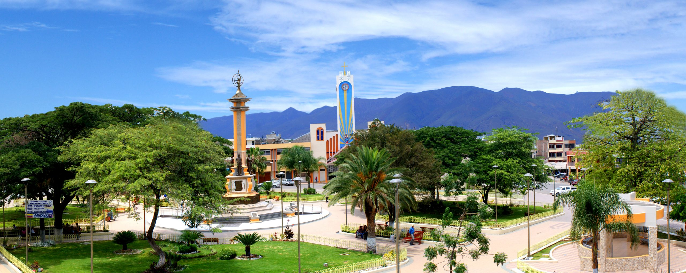

:::: hero
::: hero-text
[CATAMAYO · CATACOCHA]{.tag}

# Laboratorio Clínico Cabrera

## Resultados confiables para cuidar tu salud

Atención profesional en dos sedes, con los mismos servicios clínicos, personal capacitado y resultados oportunos.

[Agendar cita](contacto.qmd){.btn-main} [Ver sedes](sedes.qmd){.btn-secondary}
:::
::::

::: section-title
**BIENVENIDOS**

## Una marca, dos sedes, los mismos servicios
:::

::::: cards
::: card
### 📍 Sede Catamayo

Atención clínica profesional para pacientes de Catamayo y zonas cercanas.

[Ver ubicación](sedes.qmd)

{width="100%"}
:::

::: card
### 📍 Sede Catacocha

Atención clínica profesional para pacientes de Catacocha y alrededores.

[Ver ubicación](sedes.qmd)

{width="100%"}
:::
:::::

::: section-title
LO QUE HACEMOS

## Servicios disponibles en ambas sedes
:::

::::::::::: service-grid
::: service-card
### 🩸 Hematología y coagulación

Biometría hemática completa y análisis sanguíneos.

[Ver ensayos](hematologia.qmd){.btn-card}
:::

::: service-card
### 🧪 Química clínica

Metabolismo y función renal, perfil lipídico, función hepática, enzimas pancreáticas

[Ver ensayos](quimica-clinica.qmd){.btn-card}
:::

::: service-card
### 🧬 Inmunología y serología

Marcadores inflamatorios y autoinmunidad, enfermedades infecciosas, pruebas especiales

[Ver ensayos](inmunologia-serologia.qmd){.btn-card}
:::

::: service-card
### ⚕️ Hormonas y endocrinología

Función tiroidea, hormonas reproductivas, función suprarrenal y metabolismo

[Ver ensayos](hormonas-endocrinologia.qmd){.btn-card}
:::

::: service-card
### 🧫 Uroanálisis

Examen físico, químico y microscópico de orina.

[Ver ensayos](uroanalisis.qmd){.btn-card}
:::

::: service-card
### 🔬 Parasitología y coprología

Exámenes parasitológicos de heces.

[Ver ensayos](parasitologia.qmd){.btn-card}
:::

::: service-card
### 🦠 Microbiología

Gram gota fresca,panel de drogas de abuso

[Ver ensayos](microbiologia.qmd){.btn-card}
:::

::: service-card
### 💊 Toxicología

Panel de drogas de abuso

[Ver ensayos](toxicologia.qmd){.btn-card}
:::
:::::::::::

2 sedes \| +50 pruebas clínicas \| Resultados confiables
